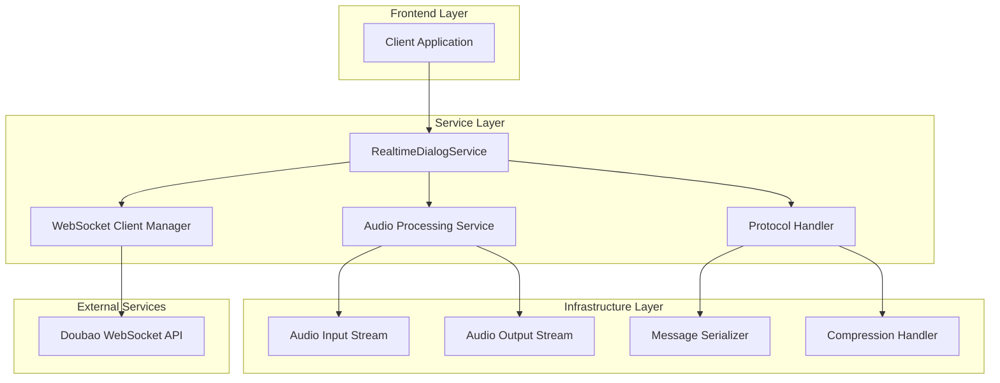
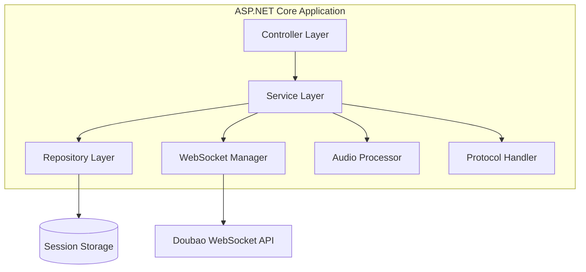
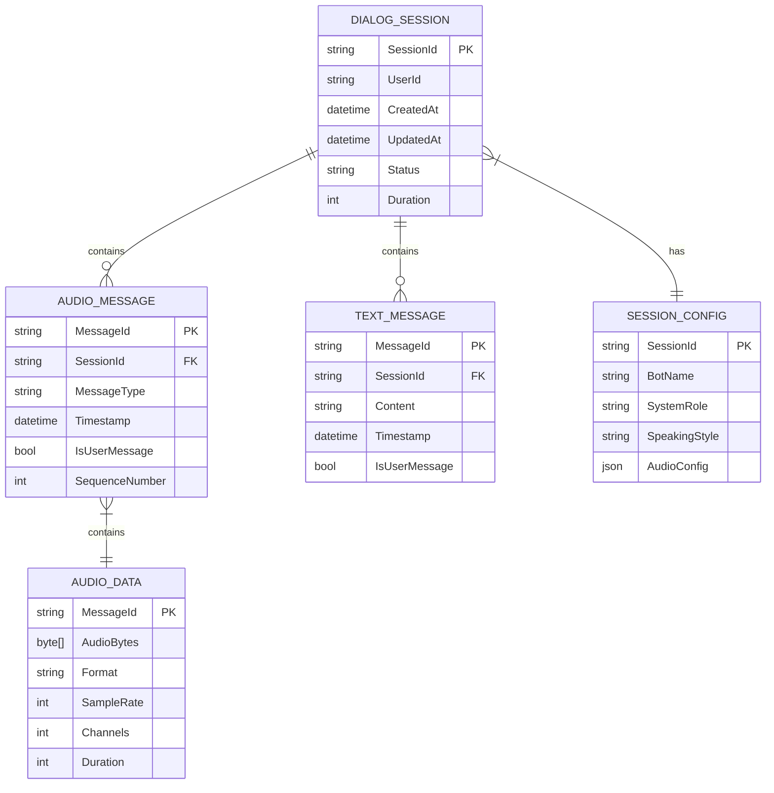

# DoubaoRealtimeDialog .NET 9 实现技术架构文档

## 1. 架构设计



## 2. 技术描述

- Frontend: React@18 + TypeScript + Web Audio API
- Backend: ASP.NET Core 9 + ClientWebSocket + System.ClientModel
- Audio Processing: NAudio (Windows) + 跨平台音频抽象层
- WebSocket: ClientWebSocket + HTTP/2 Support (.NET 9)
- Real-time Communication: WebSocket over HTTP/2 with PING/PONG Keep-Alive
- Serialization: System.Text.Json + System.IO.Compression.Gzip

## 3. 路由定义

| Route | Purpose |
|-------|----------|
| /realtime-dialog | 实时语音对话主页面 |
| /dialog/session/{sessionId} | 特定会话页面 |
| /dialog/settings | 语音设置配置页面 |
| /dialog/history | 历史会话管理页面 |
| /api/dialog/connect | WebSocket连接端点 |

## 4. API定义

### 4.1 核心API

#### WebSocket连接管理
```
WS /api/dialog/connect
```

连接参数:
| 参数名 | 参数类型 | 是否必需 | 描述 |
|--------|----------|----------|------|
| sessionId | string | true | 会话唯一标识符 |
| apiKey | string | true | Doubao API密钥 |
| appId | string | true | 应用ID |

#### 会话管理API
```
POST /api/dialog/sessions
```

请求:
| 参数名 | 参数类型 | 是否必需 | 描述 |
|--------|----------|----------|------|
| config | DialogConfig | true | 对话配置 |

响应:
| 参数名 | 参数类型 | 描述 |
|--------|----------|------|
| sessionId | string | 会话ID |
| status | string | 创建状态 |

示例:
```json
{
  "config": {
    "botName": "豆包",
    "systemRole": "你是一个友善的AI助手",
    "audioConfig": {
      "sampleRate": 24000,
      "channels": 1,
      "format": "pcm"
    }
  }
}
```

## 5. 服务器架构图



## 6. 数据模型

### 6.1 数据模型定义



### 6.2 数据定义语言

#### 会话表 (dialog_sessions)
```sql
-- 创建会话表
CREATE TABLE dialog_sessions (
    session_id NVARCHAR(50) PRIMARY KEY,
    user_id NVARCHAR(50) NOT NULL,
    created_at DATETIME2 DEFAULT GETUTCDATE(),
    updated_at DATETIME2 DEFAULT GETUTCDATE(),
    status NVARCHAR(20) DEFAULT 'active' CHECK (status IN ('active', 'finished', 'error')),
    duration_seconds INT DEFAULT 0,
    total_messages INT DEFAULT 0
);

-- 创建会话配置表
CREATE TABLE session_configs (
    session_id NVARCHAR(50) PRIMARY KEY,
    bot_name NVARCHAR(100) DEFAULT '豆包',
    system_role NVARCHAR(MAX),
    speaking_style NVARCHAR(MAX),
    audio_config NVARCHAR(MAX), -- JSON格式
    FOREIGN KEY (session_id) REFERENCES dialog_sessions(session_id)
);

-- 创建音频消息表
CREATE TABLE audio_messages (
    message_id NVARCHAR(50) PRIMARY KEY,
    session_id NVARCHAR(50) NOT NULL,
    message_type NVARCHAR(20) NOT NULL,
    timestamp DATETIME2 DEFAULT GETUTCDATE(),
    is_user_message BIT NOT NULL,
    sequence_number INT NOT NULL,
    FOREIGN KEY (session_id) REFERENCES dialog_sessions(session_id)
);

-- 创建文本消息表
CREATE TABLE text_messages (
    message_id NVARCHAR(50) PRIMARY KEY,
    session_id NVARCHAR(50) NOT NULL,
    content NVARCHAR(MAX) NOT NULL,
    timestamp DATETIME2 DEFAULT GETUTCDATE(),
    is_user_message BIT NOT NULL,
    FOREIGN KEY (session_id) REFERENCES dialog_sessions(session_id)
);

-- 创建音频数据表
CREATE TABLE audio_data (
    message_id NVARCHAR(50) PRIMARY KEY,
    audio_bytes VARBINARY(MAX) NOT NULL,
    format NVARCHAR(10) NOT NULL,
    sample_rate INT NOT NULL,
    channels INT NOT NULL,
    duration_ms INT NOT NULL,
    FOREIGN KEY (message_id) REFERENCES audio_messages(message_id)
);

-- 创建索引
CREATE INDEX idx_dialog_sessions_user_id ON dialog_sessions(user_id);
CREATE INDEX idx_dialog_sessions_created_at ON dialog_sessions(created_at DESC);
CREATE INDEX idx_audio_messages_session_id ON audio_messages(session_id);
CREATE INDEX idx_audio_messages_timestamp ON audio_messages(timestamp DESC);
CREATE INDEX idx_text_messages_session_id ON text_messages(session_id);

-- 初始化数据
INSERT INTO dialog_sessions (session_id, user_id, status)
VALUES ('demo-session-001', 'demo-user', 'active');

INSERT INTO session_configs (session_id, bot_name, system_role, speaking_style, audio_config)
VALUES (
    'demo-session-001',
    '豆包',
    '你是一个友善的AI助手，使用活泼灵动的女声，性格开朗，热爱生活。',
    '你的说话风格简洁明了，语速适中，语调自然。',
    '{"sampleRate": 24000, "channels": 1, "format": "pcm"}'
);
```

## 7. 核心组件实现

### 7.1 协议处理器 (ProtocolHandler)

负责处理Doubao实时语音协议的编码和解码：

- **消息类型**: CLIENT_FULL_REQUEST, CLIENT_AUDIO_ONLY_REQUEST, SERVER_FULL_RESPONSE, SERVER_ACK, SERVER_ERROR_RESPONSE
- **序列化方法**: JSON, NO_SERIALIZATION
- **压缩方式**: GZIP, NO_COMPRESSION
- **消息标志**: MSG_WITH_EVENT, POS_SEQUENCE, NEG_SEQUENCE

### 7.2 音频处理服务 (AudioProcessingService)

处理音频输入输出和格式转换：

- **跨平台音频**: 抽象音频设备接口，支持Windows NAudio和跨平台实现
- **输入音频**: 16kHz PCM格式，单声道
- **输出音频**: 24kHz PCM格式，单声道
- **缓冲管理**: 无锁并发队列，支持实时流处理
- **格式转换**: PCM到WAV，音频重采样
- **异步处理**: 分离音频线程和网络线程，避免阻塞

```csharp
// 跨平台音频抽象接口
public interface IAudioDevice
{
    Task StartRecordingAsync(AudioFormat format);
    Task StopRecordingAsync();
    Task PlayAudioAsync(byte[] audioData);
    event EventHandler<AudioDataEventArgs> AudioDataAvailable;
}
```

### 7.3 WebSocket客户端管理器 (WebSocketClientManager)

管理与Doubao服务的WebSocket连接：

- **连接管理**: 自动重连，HTTP/2 WebSocket支持
- **Keep-Alive策略**: .NET 9 PING/PONG机制，智能心跳检测
- **消息队列**: 分离式发送/接收队列，支持消息分片处理
- **错误处理**: 连接异常，超时处理，优雅降级
- **状态监控**: 连接状态，网络质量，延迟监控

```csharp
// .NET 9 WebSocket连接管理示例
public async Task<ClientWebSocket> CreateConnectionAsync(Uri uri)
{
    var webSocket = new ClientWebSocket();
    
    // .NET 9 HTTP/2 WebSocket支持
    webSocket.Options.HttpVersion = HttpVersion.Version20;
    webSocket.Options.HttpVersionPolicy = HttpVersionPolicy.RequestVersionOrHigher;
    
    // .NET 9 PING/PONG Keep-Alive策略
    webSocket.Options.KeepAliveInterval = TimeSpan.FromSeconds(30);
    webSocket.Options.KeepAliveTimeout = TimeSpan.FromSeconds(10);
    
    await webSocket.ConnectAsync(uri, CancellationToken.None);
    return webSocket;
}
```

### 7.4 会话管理服务 (DialogSessionService)

管理对话会话的生命周期：

- **会话创建**: 生成唯一会话ID，初始化配置
- **状态管理**: 会话状态跟踪，超时处理
- **消息存储**: 音频和文本消息持久化
- **会话清理**: 资源释放，数据清理

## 8. 错误处理策略

### 8.1 连接错误处理

```csharp
// 网络异常处理策略
public class NetworkErrorHandler
{
    private readonly ILogger<NetworkErrorHandler> _logger;
    private readonly ExponentialBackoff _backoff;
    
    public async Task<T> ExecuteWithRetryAsync<T>(Func<Task<T>> operation, 
        CancellationToken cancellationToken = default)
    {
        var attempt = 0;
        
        while (attempt < 3)
        {
            try
            {
                return await operation();
            }
            catch (WebSocketException ex) when (IsRetriableError(ex))
            {
                attempt++;
                var delay = _backoff.GetDelay(attempt);
                
                _logger.LogWarning("WebSocket连接失败，{Attempt}秒后重试 (尝试 {AttemptNumber}/3)", 
                    delay.TotalSeconds, attempt);
                    
                await Task.Delay(delay, cancellationToken);
            }
            catch (TaskCanceledException) when (cancellationToken.IsCancellationRequested)
            {
                throw new OperationCanceledException("操作已取消", cancellationToken);
            }
        }
        
        throw new InvalidOperationException("网络连接失败，请检查网络设置");
    }
    
    private static bool IsRetriableError(WebSocketException ex)
    {
        return ex.WebSocketErrorCode == WebSocketError.ConnectionClosedPrematurely ||
               ex.WebSocketErrorCode == WebSocketError.Faulted;
    }
}
```

- **连接失败**: 指数退避重连，最大重试次数限制
- **网络中断**: 自动重连，消息队列保持
- **认证失败**: 错误提示，停止重连
- **服务器错误**: 错误码解析，用户友好提示

### 8.2 音频处理错误

```csharp
// 音频异常处理
public class AudioErrorHandler
{
    public async Task<bool> HandleAudioDeviceErrorAsync(AudioDeviceException ex)
    {
        switch (ex.ErrorType)
        {
            case AudioErrorType.DeviceNotFound:
                await ShowDeviceSelectionDialogAsync();
                return true;
                
            case AudioErrorType.DeviceInUse:
                await NotifyUserDeviceBusyAsync();
                return await TryAlternativeDeviceAsync();
                
            case AudioErrorType.FormatNotSupported:
                return await TryFormatConversionAsync(ex.RequestedFormat);
                
            case AudioErrorType.BufferOverflow:
                AdjustBufferSize();
                return true;
                
            default:
                _logger.LogError(ex, "未处理的音频错误");
                return false;
        }
    }
}
```

- **设备访问失败**: 权限检查，设备列表刷新
- **格式不支持**: 自动格式转换，降级处理
- **缓冲区溢出**: 动态缓冲区调整，丢弃策略
- **编解码错误**: 错误恢复，静音填充

### 8.3 协议错误处理

- **消息格式错误**: 消息验证，错误日志记录
- **序列号错误**: 消息重排，丢失检测
- **压缩错误**: 降级到无压缩模式
- **超时错误**: 超时重传，连接检查

### 8.4 安全性保障

```csharp
// WebSocket安全验证
public class WebSocketSecurityValidator
{
    private readonly IConfiguration _configuration;
    private readonly string[] _allowedOrigins;
    
    public bool ValidateOrigin(string origin)
    {
        // 防止Cross-Site WebSocket Hijacking (CSWSH)
        return _allowedOrigins.Contains(origin, StringComparer.OrdinalIgnoreCase);
    }
    
    public async Task<bool> ValidateTokenAsync(string token)
    {
        try
        {
            var tokenHandler = new JwtSecurityTokenHandler();
            var validationParameters = GetTokenValidationParameters();
            
            var principal = tokenHandler.ValidateToken(token, validationParameters, out _);
            return principal.Identity?.IsAuthenticated == true;
        }
        catch (SecurityTokenException)
        {
            return false;
        }
    }
}
```

- **Origin验证**: 防止CSWSH攻击，白名单机制
- **Token验证**: JWT令牌验证，防止未授权访问
- **传输加密**: WSS协议，端到端加密
- **消息完整性**: 消息签名验证，防篡改

### 8.5 数据一致性保障

```csharp
// 消息序列管理
public class MessageSequenceManager
{
    private long _lastSequenceNumber;
    private readonly ConcurrentDictionary<long, DateTime> _pendingMessages;
    
    public bool ValidateSequence(long sequenceNumber)
    {
        if (sequenceNumber <= _lastSequenceNumber)
        {
            return false; // 重复或过期消息
        }
        
        _lastSequenceNumber = sequenceNumber;
        return true;
    }
    
    public void TrackPendingMessage(long sequenceNumber)
    {
        _pendingMessages.TryAdd(sequenceNumber, DateTime.UtcNow);
    }
    
    public void ConfirmMessage(long sequenceNumber)
    {
        _pendingMessages.TryRemove(sequenceNumber, out _);
    }
}
```

- **消息序列**: 序列号机制，重复检测和乱序处理
- **状态同步**: 定期状态校验，自动差异修复
- **数据备份**: 关键会话数据持久化，故障快速恢复
- **事务处理**: 原子操作保证，自动回滚机制

## 9. 性能优化方案

### 9.1 音频优化

- **低延迟处理**: 小缓冲区，实时处理
- **内存优化**: 对象池，缓冲区复用
- **CPU优化**: 多线程处理，异步操作
- **网络优化**: 数据压缩，批量发送

### 9.2 连接优化

```csharp
// .NET 9 连接池管理 - 支持HTTP/2多连接
public class ConnectionPoolManager
{
    private readonly ConcurrentStack<ClientWebSocket> _availableConnections;
    private readonly SemaphoreSlim _connectionSemaphore;
    private readonly SocketsHttpHandler _httpHandler;
    
    public ConnectionPoolManager()
    {
        _availableConnections = new ConcurrentStack<ClientWebSocket>();
        _connectionSemaphore = new SemaphoreSlim(10, 10); // 最大10个连接
        
        // .NET 9 HTTP/3多连接支持
        _httpHandler = new SocketsHttpHandler
        {
            EnableMultipleHttp3Connections = true,
            PooledConnectionLifetime = TimeSpan.FromMinutes(5)
        };
    }
    
    public async Task<ClientWebSocket> GetConnectionAsync(Uri uri, CancellationToken cancellationToken)
    {
        await _connectionSemaphore.WaitAsync(cancellationToken);
        
        if (_availableConnections.TryPop(out var connection) && 
            connection.State == WebSocketState.Open)
        {
            return connection;
        }
        
        return await CreateNewConnectionAsync(uri, cancellationToken);
    }
    
    private async Task<ClientWebSocket> CreateNewConnectionAsync(Uri uri, CancellationToken cancellationToken)
    {
        var webSocket = new ClientWebSocket();
        
        // .NET 9 WebSocket配置
        webSocket.Options.HttpVersion = HttpVersion.Version20;
        webSocket.Options.HttpVersionPolicy = HttpVersionPolicy.RequestVersionOrHigher;
        webSocket.Options.KeepAliveInterval = TimeSpan.FromSeconds(30);
        webSocket.Options.KeepAliveTimeout = TimeSpan.FromSeconds(10);
        
        // 安全配置
        webSocket.Options.SetRequestHeader("Origin", "https://easyvoice.net");
        
        await webSocket.ConnectAsync(uri, new HttpMessageInvoker(_httpHandler), cancellationToken);
        return webSocket;
    }
    
    public void ReturnConnection(ClientWebSocket connection)
    {
        if (connection.State == WebSocketState.Open)
        {
            _availableConnections.Push(connection);
        }
        
        _connectionSemaphore.Release();
    }
}
```

- **连接池**: WebSocket连接复用，HTTP/3多连接支持
- **消息压缩**: GZIP压缩，减少带宽占用
- **心跳优化**: .NET 9智能心跳间隔
- **队列优化**: 优先级队列，消息合并处理

### 9.3 存储优化

- **缓存策略**: Redis缓存，会话状态缓存
- **数据库优化**: 索引优化，分区表
- **文件存储**: 音频文件分片存储
- **清理策略**: 定期清理，过期数据删除

## 10. 与EasyVoice.Net项目集成方案

### 10.1 项目结构集成

```
EasyVoice.Net/
├── src/
│   ├── EasyVoice.Core/
│   │   ├── Interfaces/
│   │   │   └── IRealtimeDialogService.cs    # 实时对话服务接口
│   │   └── Models/
│   │       └── RealtimeDialog/              # 实时对话模型
│   ├── EasyVoice.TTS/
│   │   └── Extensions/
│   │       └── RealtimeDialogExtensions.cs  # TTS服务扩展
│   ├── EasyVoice.RealtimeDialog/            # 新增实时对话模块
│   │   ├── Models/
│   │   │   ├── Protocol/                    # 协议模型
│   │   │   ├── Audio/                       # 音频模型
│   │   │   └── Session/                     # 会话模型
│   │   ├── Services/
│   │   │   ├── IRealtimeDialogService.cs
│   │   │   ├── RealtimeDialogService.cs
│   │   │   ├── WebSocketClientManager.cs
│   │   │   └── AudioProcessingService.cs
│   │   ├── Protocols/
│   │   │   ├── DoubaoProtocolHandler.cs
│   │   │   └── MessageSerializer.cs
│   │   ├── Audio/
│   │   │   ├── IAudioDevice.cs
│   │   │   ├── WindowsAudioDevice.cs
│   │   │   └── CrossPlatformAudioDevice.cs
│   │   └── Extensions/
│   │       └── ServiceCollectionExtensions.cs
│   └── EasyVoice.API/
│       ├── Controllers/
│       │   └── RealtimeDialogController.cs
│       └── Hubs/
│           └── RealtimeDialogHub.cs         # SignalR Hub
├── tests/
│   └── EasyVoice.RealtimeDialog.Tests/
└── docs/
    └── RealtimeDialog/
```

### 10.2 服务注册集成

```csharp
// Program.cs
using EasyVoice.RealtimeDialog.Extensions;

var builder = WebApplication.CreateBuilder(args);

// 添加现有EasyVoice服务
builder.Services.AddEasyVoiceCore();
builder.Services.AddEasyVoiceTTS();

// 添加实时对话服务
builder.Services.AddRealtimeDialog(options =>
{
    options.DoubaoApiKey = builder.Configuration["Doubao:ApiKey"];
    options.WebSocketEndpoint = builder.Configuration["Doubao:WebSocketEndpoint"];
    options.AudioFormat = new AudioFormat
    {
        SampleRate = 16000,
        BitsPerSample = 16,
        Channels = 1
    };
    options.MaxConcurrentSessions = 100;
    options.SessionTimeout = TimeSpan.FromMinutes(30);
});

// 添加SignalR支持
builder.Services.AddSignalR();

var app = builder.Build();

// 配置SignalR Hub
app.MapHub<RealtimeDialogHub>("/hubs/realtimedialog");

app.Run();
```

### 10.3 服务扩展实现

```csharp
// Extensions/ServiceCollectionExtensions.cs
namespace EasyVoice.RealtimeDialog.Extensions;

public static class ServiceCollectionExtensions
{
    public static IServiceCollection AddRealtimeDialog(
        this IServiceCollection services,
        Action<RealtimeDialogOptions> configureOptions)
    {
        services.Configure(configureOptions);
        
        // 注册核心服务
        services.AddSingleton<IRealtimeDialogService, RealtimeDialogService>();
        services.AddSingleton<WebSocketClientManager>();
        services.AddSingleton<AudioProcessingService>();
        services.AddSingleton<DoubaoProtocolHandler>();
        
        // 注册音频设备（根据平台选择）
        if (OperatingSystem.IsWindows())
        {
            services.AddSingleton<IAudioDevice, WindowsAudioDevice>();
        }
        else
        {
            services.AddSingleton<IAudioDevice, CrossPlatformAudioDevice>();
        }
        
        // 注册错误处理器
        services.AddSingleton<NetworkErrorHandler>();
        services.AddSingleton<AudioErrorHandler>();
        services.AddSingleton<WebSocketSecurityValidator>();
        
        // 注册连接池管理器
        services.AddSingleton<ConnectionPoolManager>();
        
        return services;
    }
}
```

### 10.4 API控制器集成

```csharp
// Controllers/RealtimeDialogController.cs
using EasyVoice.Core.Interfaces;
using EasyVoice.RealtimeDialog.Models;
using Microsoft.AspNetCore.Authorization;
using Microsoft.AspNetCore.Mvc;

[ApiController]
[Route("api/[controller]")]
[Authorize] // 继承EasyVoice.Net的认证机制
public class RealtimeDialogController : ControllerBase
{
    private readonly IRealtimeDialogService _dialogService;
    private readonly ILogger<RealtimeDialogController> _logger;
    
    public RealtimeDialogController(
        IRealtimeDialogService dialogService,
        ILogger<RealtimeDialogController> logger)
    {
        _dialogService = dialogService;
        _logger = logger;
    }
    
    [HttpPost("sessions")]
    public async Task<IActionResult> CreateSession([FromBody] CreateSessionRequest request)
    {
        try
        {
            var userId = User.GetUserId(); // 使用EasyVoice.Net的用户系统
            var sessionId = await _dialogService.CreateSessionAsync(userId, request);
            
            return Ok(new CreateSessionResponse
            {
                SessionId = sessionId,
                WebSocketUrl = $"wss://{Request.Host}/hubs/realtimedialog?sessionId={sessionId}"
            });
        }
        catch (Exception ex)
        {
            _logger.LogError(ex, "创建实时对话会话失败");
            return StatusCode(500, "创建会话失败");
        }
    }
    
    [HttpDelete("sessions/{sessionId}")]
    public async Task<IActionResult> EndSession(string sessionId)
    {
        try
        {
            var userId = User.GetUserId();
            await _dialogService.EndSessionAsync(userId, sessionId);
            return NoContent();
        }
        catch (UnauthorizedAccessException)
        {
            return Forbid();
        }
        catch (Exception ex)
        {
            _logger.LogError(ex, "结束实时对话会话失败");
            return StatusCode(500, "结束会话失败");
        }
    }
    
    [HttpGet("sessions/{sessionId}/status")]
    public async Task<IActionResult> GetSessionStatus(string sessionId)
    {
        try
        {
            var userId = User.GetUserId();
            var status = await _dialogService.GetSessionStatusAsync(userId, sessionId);
            return Ok(status);
        }
        catch (NotFoundException)
        {
            return NotFound();
        }
    }
}
```

### 10.5 SignalR Hub集成

```csharp
// Hubs/RealtimeDialogHub.cs
using Microsoft.AspNetCore.Authorization;
using Microsoft.AspNetCore.SignalR;
using EasyVoice.RealtimeDialog.Services;

[Authorize]
public class RealtimeDialogHub : Hub
{
    private readonly IRealtimeDialogService _dialogService;
    private readonly ILogger<RealtimeDialogHub> _logger;
    
    public RealtimeDialogHub(
        IRealtimeDialogService dialogService,
        ILogger<RealtimeDialogHub> logger)
    {
        _dialogService = dialogService;
        _logger = logger;
    }
    
    public async Task JoinSession(string sessionId)
    {
        try
        {
            var userId = Context.User?.GetUserId();
            await _dialogService.JoinSessionAsync(userId, sessionId, Context.ConnectionId);
            await Groups.AddToGroupAsync(Context.ConnectionId, $"Session_{sessionId}");
            
            await Clients.Caller.SendAsync("SessionJoined", sessionId);
        }
        catch (Exception ex)
        {
            _logger.LogError(ex, "加入会话失败: {SessionId}", sessionId);
            await Clients.Caller.SendAsync("Error", "加入会话失败");
        }
    }
    
    public async Task SendAudioData(string sessionId, byte[] audioData)
    {
        try
        {
            var userId = Context.User?.GetUserId();
            await _dialogService.ProcessAudioDataAsync(userId, sessionId, audioData);
        }
        catch (Exception ex)
        {
            _logger.LogError(ex, "处理音频数据失败: {SessionId}", sessionId);
            await Clients.Caller.SendAsync("Error", "音频处理失败");
        }
    }
    
    public override async Task OnDisconnectedAsync(Exception exception)
    {
        try
        {
            var userId = Context.User?.GetUserId();
            await _dialogService.HandleDisconnectionAsync(userId, Context.ConnectionId);
        }
        catch (Exception ex)
        {
            _logger.LogError(ex, "处理断开连接失败");
        }
        
        await base.OnDisconnectedAsync(exception);
    }
}
```

### 10.6 前端集成方案

```typescript
// 前端SignalR客户端集成
import { HubConnectionBuilder, HubConnection } from '@microsoft/signalr';

class RealtimeDialogClient {
    private connection: HubConnection;
    private audioContext: AudioContext;
    private mediaRecorder: MediaRecorder;
    private sessionId: string;
    
    constructor(private apiBaseUrl: string) {
        this.connection = new HubConnectionBuilder()
            .withUrl(`${apiBaseUrl}/hubs/realtimedialog`, {
                accessTokenFactory: () => this.getAccessToken()
            })
            .withAutomaticReconnect()
            .build();
            
        this.setupEventHandlers();
    }
    
    private setupEventHandlers(): void {
        this.connection.on('SessionJoined', (sessionId: string) => {
            console.log('已加入会话:', sessionId);
            this.onSessionJoined?.(sessionId);
        });
        
        this.connection.on('AudioResponse', (audioData: ArrayBuffer) => {
            this.playAudio(audioData);
        });
        
        this.connection.on('TextResponse', (text: string) => {
            this.onTextReceived?.(text);
        });
        
        this.connection.on('Error', (error: string) => {
            console.error('实时对话错误:', error);
            this.onError?.(error);
        });
    }
    
    async createSession(config: SessionConfig): Promise<string> {
        const response = await fetch(`${this.apiBaseUrl}/api/realtimedialog/sessions`, {
            method: 'POST',
            headers: {
                'Content-Type': 'application/json',
                'Authorization': `Bearer ${this.getAccessToken()}`
            },
            body: JSON.stringify(config)
        });
        
        const result = await response.json();
        this.sessionId = result.sessionId;
        return this.sessionId;
    }
    
    async connect(): Promise<void> {
        await this.connection.start();
        await this.connection.invoke('JoinSession', this.sessionId);
    }
    
    async startRecording(): Promise<void> {
        const stream = await navigator.mediaDevices.getUserMedia({ 
            audio: {
                sampleRate: 16000,
                channelCount: 1,
                echoCancellation: true,
                noiseSuppression: true
            } 
        });
        
        this.mediaRecorder = new MediaRecorder(stream, {
            mimeType: 'audio/webm;codecs=pcm'
        });
        
        this.mediaRecorder.ondataavailable = async (event) => {
            if (event.data.size > 0) {
                const audioBuffer = await event.data.arrayBuffer();
                await this.connection.invoke('SendAudioData', this.sessionId, audioBuffer);
            }
        };
        
        this.mediaRecorder.start(100); // 每100ms发送一次数据
    }
    
    stopRecording(): void {
        if (this.mediaRecorder && this.mediaRecorder.state === 'recording') {
            this.mediaRecorder.stop();
        }
    }
    
    private async playAudio(audioData: ArrayBuffer): Promise<void> {
        if (!this.audioContext) {
            this.audioContext = new AudioContext();
        }
        
        const audioBuffer = await this.audioContext.decodeAudioData(audioData);
        const source = this.audioContext.createBufferSource();
        source.buffer = audioBuffer;
        source.connect(this.audioContext.destination);
        source.start();
    }
    
    async disconnect(): Promise<void> {
        this.stopRecording();
        
        if (this.sessionId) {
            await fetch(`${this.apiBaseUrl}/api/realtimedialog/sessions/${this.sessionId}`, {
                method: 'DELETE',
                headers: {
                    'Authorization': `Bearer ${this.getAccessToken()}`
                }
            });
        }
        
        await this.connection.stop();
    }
    
    private getAccessToken(): string {
        // 集成EasyVoice.Net的认证系统
        return localStorage.getItem('easyvoice_token') || '';
    }
    
    // 事件回调
    onSessionJoined?: (sessionId: string) => void;
    onTextReceived?: (text: string) => void;
    onError?: (error: string) => void;
}

// 使用示例
const client = new RealtimeDialogClient('https://api.easyvoice.net');

// 创建并连接会话
const sessionId = await client.createSession({
    voice: 'zh-CN-XiaoxiaoNeural',
    language: 'zh-CN',
    audioFormat: 'pcm_16000'
});

await client.connect();
await client.startRecording();
```

### 10.7 配置文件集成

```json
// appsettings.json
{
  "EasyVoice": {
    "TTS": {
      // 现有TTS配置
    },
    "RealtimeDialog": {
      "Doubao": {
        "ApiKey": "your-doubao-api-key",
        "WebSocketEndpoint": "wss://openspeech.bytedance.com/api/v1/ws",
        "MaxConcurrentSessions": 100,
        "SessionTimeoutMinutes": 30
      },
      "Audio": {
        "InputFormat": {
          "SampleRate": 16000,
          "BitsPerSample": 16,
          "Channels": 1
        },
        "OutputFormat": {
          "SampleRate": 24000,
          "BitsPerSample": 16,
          "Channels": 1
        },
        "BufferSizeMs": 100,
        "MaxBufferSizeMs": 1000
      },
      "WebSocket": {
        "KeepAliveIntervalSeconds": 30,
        "KeepAliveTimeoutSeconds": 10,
        "MaxRetryAttempts": 3,
        "RetryDelaySeconds": [1, 2, 4]
      },
      "Security": {
        "AllowedOrigins": [
          "https://easyvoice.net",
          "https://app.easyvoice.net",
          "http://localhost:3000"
        ],
        "RequireHttps": true,
        "ValidateOrigin": true
      }
    }
  }
}
```

这个技术架构文档提供了完整的.NET 9实时语音对话功能实现方案，确保与现有EasyVoice.Net项目的无缝集成。