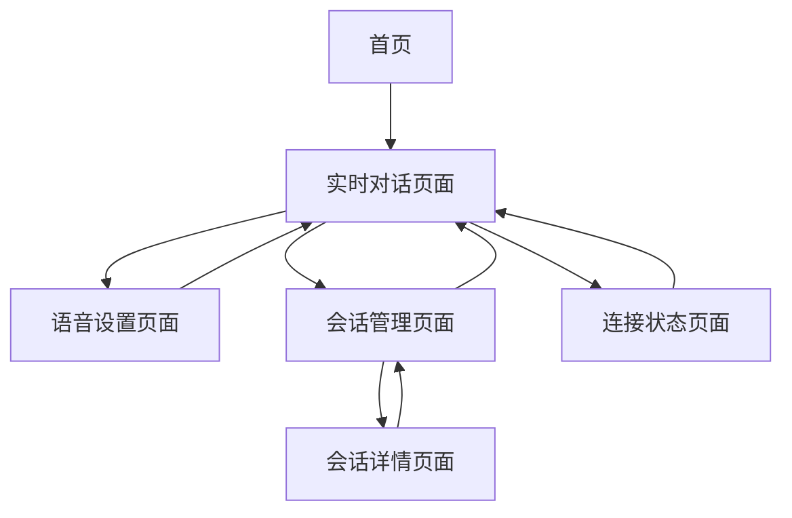

# EasyVoice.Net 实时语音对话功能产品需求文档

## 1. 产品概述

EasyVoice.Net实时语音对话功能是一个基于豆包AI的智能语音交互系统，用户可以通过语音与AI助手进行自然对话，获得实时的语音回复。该功能为用户提供了更加自然、便捷的AI交互体验，支持多种语音配置和个性化设置。

产品旨在解决传统文本交互效率低、体验不够自然的问题，让用户能够像与真人对话一样与AI进行交流，适用于语音助手、客服机器人、教育辅导等多种场景。

## 2. 核心功能

### 2.1 用户角色

| 角色 | 注册方式 | 核心权限 |
|------|----------|----------|
| 普通用户 | 邮箱注册或第三方登录 | 可使用基础实时语音对话功能，每日限制对话时长 |
| 高级用户 | 付费升级或邀请码 | 无限制使用实时语音对话，可自定义语音参数和AI角色 |

### 2.2 功能模块

我们的实时语音对话需求包含以下主要页面：

1. **实时对话页面**: 语音交互界面、音频可视化、对话控制面板
2. **会话管理页面**: 历史会话列表、会话详情查看、会话导出功能
3. **语音设置页面**: 音频参数配置、AI角色设定、语音风格选择
4. **连接状态页面**: 连接诊断、网络状态监控、错误日志查看

### 2.3 页面详情

| 页面名称 | 模块名称 | 功能描述 |
|----------|----------|----------|
| 实时对话页面 | 语音交互界面 | 显示麦克风状态、录音按钮、音频波形可视化、对话状态指示器 |
| 实时对话页面 | 对话控制面板 | 开始/停止对话、暂停/恢复、音量调节、语速控制 |
| 实时对话页面 | 消息显示区域 | 实时显示对话文本、支持消息历史滚动、语音播放状态 |
| 会话管理页面 | 会话列表 | 显示历史会话、会话时长、创建时间、会话状态筛选 |
| 会话管理页面 | 会话详情 | 查看完整对话记录、音频回放、文本导出、会话统计 |
| 会话管理页面 | 会话操作 | 删除会话、重命名会话、分享会话、收藏会话 |
| 语音设置页面 | 音频配置 | 设置采样率、音频格式、缓冲区大小、噪声抑制开关 |
| 语音设置页面 | AI角色设定 | 选择AI性格、设置系统提示词、配置说话风格、语调偏好 |
| 语音设置页面 | 语音风格 | 选择语音类型、语速调节、音调设置、情感表达强度 |
| 连接状态页面 | 连接诊断 | 显示WebSocket连接状态、网络延迟、音频质量指标 |
| 连接状态页面 | 状态监控 | 实时监控连接稳定性、错误统计、性能指标图表 |
| 连接状态页面 | 错误处理 | 显示错误日志、重连按钮、网络测试工具、故障排除指南 |

## 3. 核心流程

### 3.1 用户操作流程

**主要用户流程**：
1. 用户进入实时对话页面
2. 系统自动检测麦克风权限并初始化音频设备
3. 用户点击"开始对话"按钮创建新会话
4. 系统建立WebSocket连接并显示连接状态
5. 用户按住录音按钮开始说话
6. 系统实时传输音频数据到后端
7. AI处理语音并返回语音回复
8. 系统播放AI回复的语音
9. 用户可继续对话或结束会话
10. 会话结束后自动保存到历史记录

**设置配置流程**：
1. 用户进入语音设置页面
2. 调整音频参数（采样率、缓冲区等）
3. 选择AI角色和说话风格
4. 测试语音效果
5. 保存配置并应用到新会话

**会话管理流程**：
1. 用户进入会话管理页面
2. 浏览历史会话列表
3. 点击会话查看详细内容
4. 可播放历史音频或导出文本
5. 管理会话（删除、重命名、收藏）

### 3.2 页面导航流程图

## 4. 用户界面设计

### 4.1 设计风格

- **主色调**: 深蓝色 (#1E3A8A) 和亮蓝色 (#3B82F6)
- **辅助色**: 绿色 (#10B981) 表示连接成功，红色 (#EF4444) 表示错误状态，橙色 (#F59E0B) 表示警告
- **按钮风格**: 圆角矩形按钮，支持悬停和按下状态的渐变效果
- **字体**: 主要使用 Inter 字体，中文使用苹方或微软雅黑，代码使用 Fira Code
- **字体大小**: 标题 24px，正文 16px，小字 14px，按钮文字 16px
- **布局风格**: 卡片式设计，顶部导航栏，左侧边栏可折叠
- **图标风格**: 使用 Heroicons 线性图标，支持动画效果
- **动画**: 使用 CSS transitions 和 Framer Motion，过渡时间 200-300ms

### 4.2 页面设计概览

| 页面名称 | 模块名称 | UI元素 |
|----------|----------|--------|
| 实时对话页面 | 语音交互界面 | 大型圆形录音按钮（红色录音状态），音频波形可视化（实时动画），连接状态指示器（绿色/红色圆点） |
| 实时对话页面 | 对话控制面板 | 水平排列的控制按钮，音量滑块（蓝色轨道），语速调节器，暂停/播放切换按钮 |
| 实时对话页面 | 消息显示区域 | 聊天气泡样式（用户消息右对齐蓝色，AI消息左对齐灰色），滚动区域，时间戳显示 |
| 会话管理页面 | 会话列表 | 卡片式列表，每个会话显示标题、时间、时长，支持搜索和筛选 |
| 会话管理页面 | 会话详情 | 模态对话框或侧边栏，显示完整对话记录，音频播放器，导出按钮 |
| 语音设置页面 | 音频配置 | 表单样式，下拉选择器，数值输入框，开关按钮，实时预览区域 |
| 语音设置页面 | AI角色设定 | 角色卡片选择器，文本输入框，预设模板选择，语音试听按钮 |
| 连接状态页面 | 连接诊断 | 仪表盘样式，实时数据图表，状态指示灯，网络质量评分 |
| 连接状态页面 | 错误处理 | 错误列表，时间线样式，重连按钮（大型绿色按钮），帮助文档链接 |

### 4.3 响应式设计

产品采用移动优先的响应式设计，支持桌面端、平板和手机端：

- **桌面端** (≥1024px): 三栏布局，左侧导航，中间主内容，右侧状态面板
- **平板端** (768px-1023px): 两栏布局，可折叠侧边栏，主内容区域自适应
- **手机端** (<768px): 单栏布局，底部导航栏，全屏对话界面
- **触摸优化**: 按钮最小点击区域44px，支持手势操作（长按录音，滑动调节音量）
- **音频控制**: 移动端优化的大型录音按钮，音量和语速通过滑动手势控制

## 5. 技术要求

### 5.1 性能要求

- **音频延迟**: 端到端延迟不超过500ms
- **连接建立**: WebSocket连接建立时间不超过3秒
- **音频质量**: 支持16kHz和24kHz采样率，确保语音清晰度
- **并发支持**: 单服务器支持至少100个并发会话
- **内存使用**: 单会话内存占用不超过50MB

### 5.2 兼容性要求

- **浏览器支持**: Chrome 80+, Firefox 75+, Safari 13+, Edge 80+
- **移动端**: iOS 13+, Android 8+
- **音频API**: 支持Web Audio API和MediaRecorder API
- **WebSocket**: 支持WebSocket协议和自动重连

### 5.3 安全要求

- **数据传输**: 使用WSS加密传输音频数据
- **权限控制**: 严格的用户身份验证和会话隔离
- **隐私保护**: 音频数据不持久化存储，会话结束后自动清理
- **访问控制**: 基于Token的API访问控制

## 6. 用户体验要求

### 6.1 易用性

- **一键开始**: 用户可通过单击开始语音对话
- **视觉反馈**: 清晰的录音状态指示和音频可视化
- **错误提示**: 友好的错误信息和解决建议
- **快捷操作**: 支持键盘快捷键（空格键录音，ESC键停止）

### 6.2 可访问性

- **屏幕阅读器**: 支持ARIA标签和语义化HTML
- **键盘导航**: 完整的键盘操作支持
- **高对比度**: 支持高对比度模式
- **字体缩放**: 支持浏览器字体缩放

### 6.3 国际化

- **多语言**: 支持中文、英文界面
- **语音识别**: 支持中英文语音识别和合成
- **时区处理**: 正确显示本地时间
- **数字格式**: 根据地区显示数字和时间格式

## 7. 质量保证

### 7.1 测试要求

- **功能测试**: 覆盖所有核心功能和边界情况
- **性能测试**: 音频延迟、并发处理、内存使用测试
- **兼容性测试**: 多浏览器、多设备测试
- **用户体验测试**: 真实用户场景测试

### 7.2 监控指标

- **技术指标**: 连接成功率、音频质量、错误率
- **业务指标**: 用户活跃度、会话时长、功能使用率
- **用户反馈**: 满意度评分、问题反馈、改进建议

这个产品需求文档详细定义了实时语音对话功能的完整规格，为开发团队提供了清晰的产品目标和实现标准。