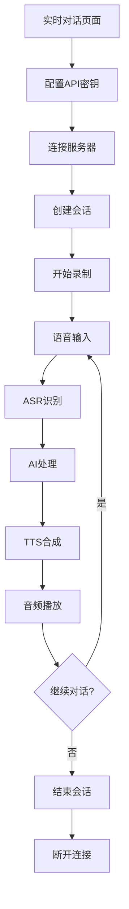

## 1. Product Overview
豆包实时语音对话系统是一个基于Web的实时语音交互平台，用户可以通过浏览器与豆包AI进行实时语音对话。
- 解决用户需要便捷、实时的语音AI交互需求，支持语音输入识别、AI回复和语音合成播放的完整对话流程。
- 目标是为用户提供流畅、低延迟的语音AI交互体验，适用于客服、教育、娱乐等多种场景。

## 2. Core Features

### 2.1 User Roles
本产品为单用户系统，无需复杂的角色区分。

### 2.2 Feature Module
我们的豆包实时语音对话系统包含以下主要页面：
1. **实时对话页面**：连接控制、会话管理、音频控制、事件日志展示。

### 2.3 Page Details

| Page Name | Module Name | Feature description |
|-----------|-------------|---------------------|
| 实时对话页面 | 连接控制模块 | 建立和断开与后端SignalR Hub的WebSocket连接，显示连接状态 |
| 实时对话页面 | 会话管理模块 | 创建豆包对话会话、配置API密钥、结束会话，显示会话ID |
| 实时对话页面 | 音频控制模块 | 开始/停止麦克风录制、实时音频数据传输、音频参数配置、ChatTTS文本输入 |
| 实时对话页面 | 事件日志模块 | 实时显示ASR识别、TTS合成、会话状态等事件信息，支持JSON格式查看 |

## 3. Core Process

### 主要用户操作流程：
1. 用户打开实时对话页面
2. 配置豆包API密钥（App ID和Access Key）
3. 点击"连接服务器"建立SignalR连接
4. 点击"创建会话"初始化豆包对话会话
5. 点击"开始录制"启动麦克风录制和实时音频传输
6. 用户说话，系统实时传输音频到后端进行ASR识别
7. 豆包AI处理用户输入并返回回复内容
8. 系统将AI回复进行TTS合成并播放给用户
9. 用户可选择发送ChatTTS文本进行额外的语音合成
10. 完成对话后点击"结束会话"和"断开连接"

## 4. User Interface Design

### 4.1 Design Style
- 主色调：蓝色系（#1890ff）和绿色系（#52c41a）表示连接状态
- 按钮样式：圆角按钮，支持禁用状态的视觉反馈
- 字体：系统默认字体，标题使用粗体，正文使用常规字体
- 布局风格：卡片式布局，响应式网格系统，清晰的模块分区
- 图标风格：使用Lucide React图标库，简洁现代的线性图标

### 4.2 Page Design Overview

| Page Name | Module Name | UI Elements |
|-----------|-------------|-------------|
| 实时对话页面 | 连接控制模块 | 蓝色主按钮用于连接，灰色次要按钮用于断开，绿色/灰色状态徽章显示连接状态 |
| 实时对话页面 | 会话管理模块 | 输入框用于API配置，支持密码类型隐藏Access Key，蓝色创建按钮和红色危险按钮用于结束 |
| 实时对话页面 | 音频控制模块 | 红色录制按钮带麦克风图标，数字输入框用于音频参数，多行文本框用于ChatTTS输入 |
| 实时对话页面 | 事件日志模块 | 滚动容器显示事件列表，每个事件使用卡片样式，JSON数据使用代码块格式化显示 |

### 4.3 Responsiveness
产品采用桌面优先设计，支持移动端自适应，使用CSS Grid和Flexbox实现响应式布局，在移动设备上优化触摸交互体验。