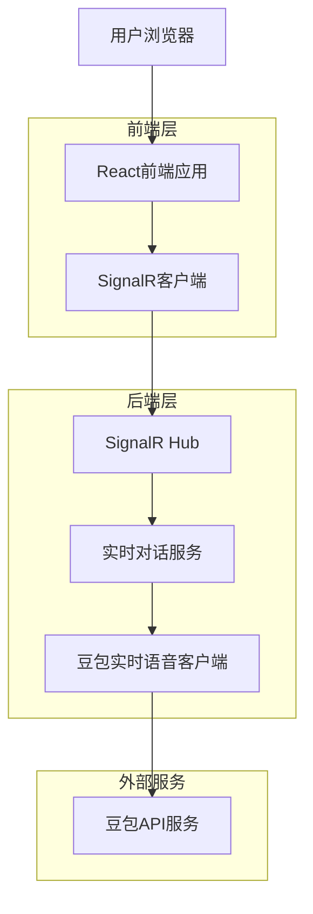
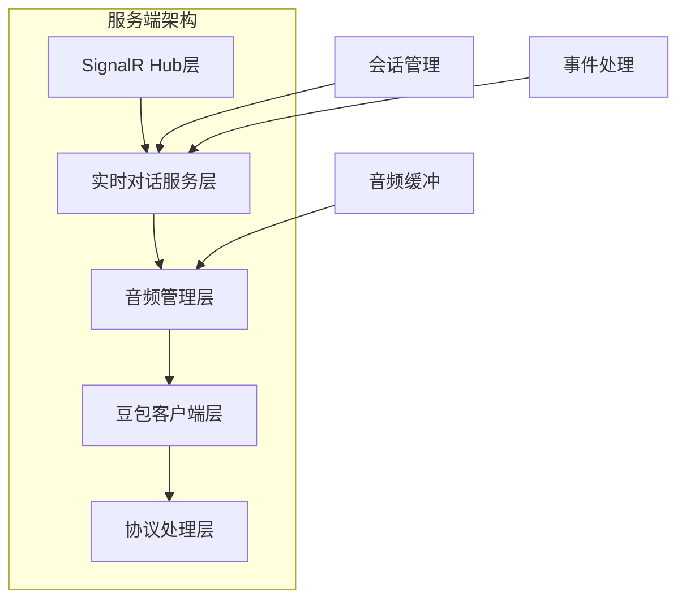
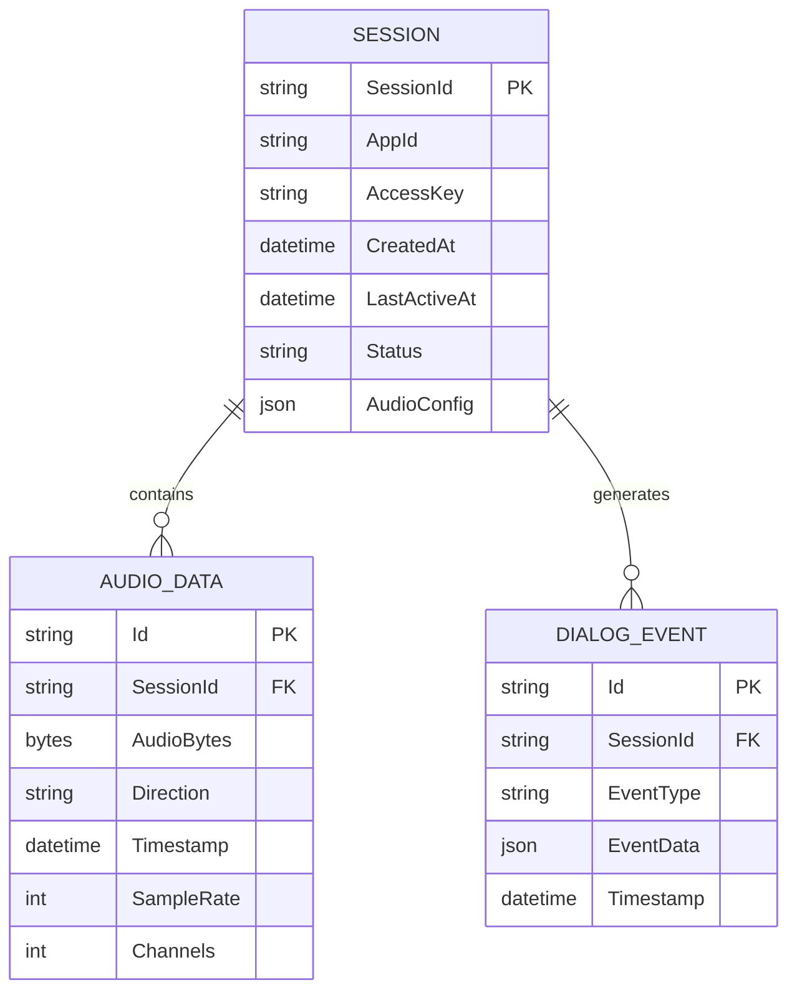

## 1. Architecture design



## 2. Technology Description

* Frontend: React\@18 + TypeScript + Antd + SignalR Client + Tailwind CSS + Vite

* Backend: ASP.NET Core + SignalR + NAudio + System.Text.Json

* Real-time Communication: SignalR WebSocket

* Audio Processing: NAudio (后端) + Web Audio API (前端)

## 3. Route definitions

| Route            | Purpose                |
| ---------------- | ---------------------- |
| /realtime-dialog | 豆包实时语音对话页面，提供完整的语音交互功能 |

## 4. API definitions

### 4.1 SignalR Hub接口

#### RealtimeDialogHub

**连接管理**

```csharp
// 客户端连接事件
OnConnectedAsync()
// 客户端断开事件  
OnDisconnectedAsync(Exception exception)
```

**会话管理**

```csharp
// 创建对话会话
Task<string> CreateSession(SessionConfig config)
```

Request:

| Param Name  | Param Type  | isRequired | Description |
| ----------- | ----------- | ---------- | ----------- |
| appId       | string      | true       | 豆包应用ID      |
| accessKey   | string      | true       | 豆包访问密钥      |
| audioConfig | AudioConfig | true       | 音频配置参数      |
| botName     | string      | false      | 机器人名称       |
| systemRole  | string      | false      | 系统角色设定      |

Response:

| Param Name | Param Type | Description |
| ---------- | ---------- | ----------- |
| sessionId  | string     | 创建的会话ID     |

```csharp
// 结束对话会话
Task EndSession(string sessionId)
```

**音频控制**

```csharp
// 设置音频配置
Task SetAudioConfig(AudioConfig config)
// 开始录制
Task<bool> StartRecording()
// 停止录制  
Task StopRecording()
// 发送音频数据
Task SendAudio(string sessionId, byte[] audioData, bool isEnd)
// 发送ChatTTS文本
Task<bool> SendChatTtsText(string sessionId, string text)
```

### 4.2 客户端事件接口

**ASR事件**

```csharp
// ASR信息事件（检测到语音）
OnAsrInfo(object data)
// ASR识别结果
OnAsrResponse(object data) 
// ASR识别结束
OnAsrEnded(object data)
```

**TTS事件**

```csharp
// TTS音频响应
OnTtsResponse(object data)
```

**会话事件**

```csharp
// 会话开始
OnSessionStarted(string sessionId)
// 会话结束
OnSessionEnded(string sessionId)
// 错误事件
OnError(string error)
```

**音频设备事件**

```csharp
// 录制开始
OnRecordingStarted(string deviceId)
// 录制停止
OnRecordingStopped(string deviceId)
// 播放开始
OnPlaybackStarted(string deviceId)
// 播放停止  
OnPlaybackStopped(string deviceId)
// 音频错误
OnAudioError(string error)
```

## 5. Server architecture diagram



## 6. Data model

### 6.1 Data model definition



### 6.2 Data Definition Language

**会话配置模型**

```csharp
public class SessionConfig
{
    public string AppId { get; set; } = string.Empty;
    public string AccessKey { get; set; } = string.Empty;
    public AudioConfig AudioConfig { get; set; } = new();
    public string? BotName { get; set; }
    public string? SystemRole { get; set; }
    public string? SpeakingStyle { get; set; }
    public string? Cluster { get; set; }
    public string? VoiceType { get; set; }
    public string? AudioEncoding { get; set; }
    public int? SampleRate { get; set; }
    public bool? EnableServerVad { get; set; }
}
```

**音频配置模型**

```csharp
public class AudioConfig
{
    public int SampleRate { get; set; } = 16000;
    public int Channels { get; set; } = 1;
    public int BitDepth { get; set; } = 16;
    public string Format { get; set; } = "pcm";
    public int ChunkSize { get; set; } = 3200;
}
```

**会话信息模型**

```csharp
public class SessionInfo
{
    public string SessionId { get; set; } = string.Empty;
    public SessionConfig Config { get; set; } = new();
    public DateTime CreatedAt { get; set; } = DateTime.UtcNow;
    public DateTime LastActiveAt { get; set; } = DateTime.UtcNow;
    public string Status { get; set; } = "Created";
    public DoubaoAudioManager? AudioManager { get; set; }
}
```

**对话事件模型**

```csharp
public class DialogEvent
{
    public string Id { get; set; } = Guid.NewGuid().ToString();
    public string Type { get; set; } = string.Empty;
    public string Timestamp { get; set; } = DateTime.Now.ToString("HH:mm:ss");
    public object? Data { get; set; }
}
```

**音频数据模型**

```csharp
public class AudioData
{
    public string SessionId { get; set; } = string.Empty;
    public byte[] Data { get; set; } = Array.Empty<byte>();
    public int SampleRate { get; set; }
    public int Channels { get; set; }
    public string Direction { get; set; } = string.Empty; // "Input" or "Output"
    public DateTime Timestamp { get; set; } = DateTime.UtcNow;
}
```

