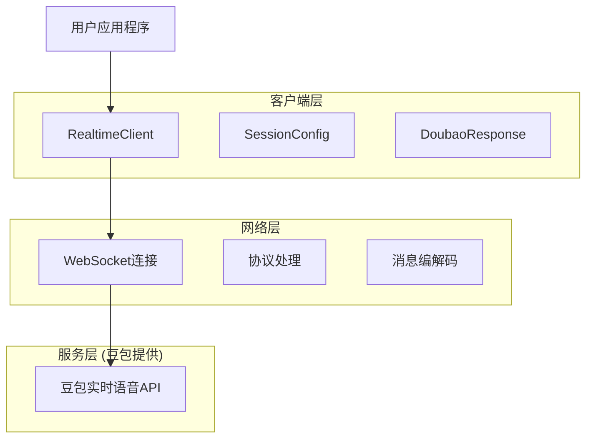
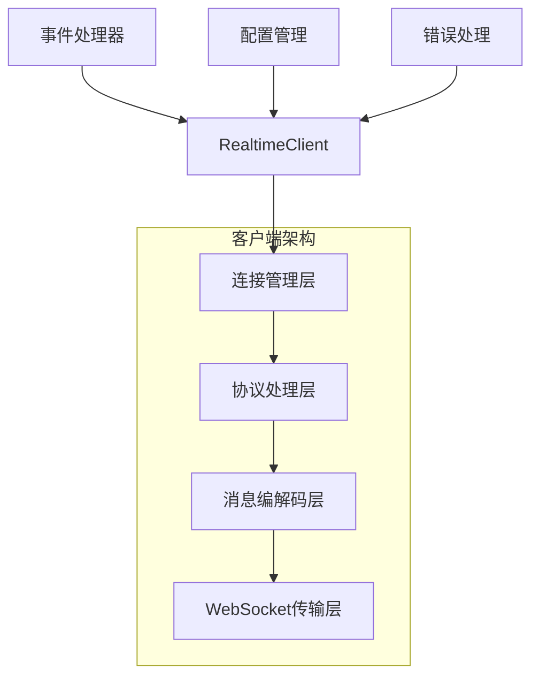
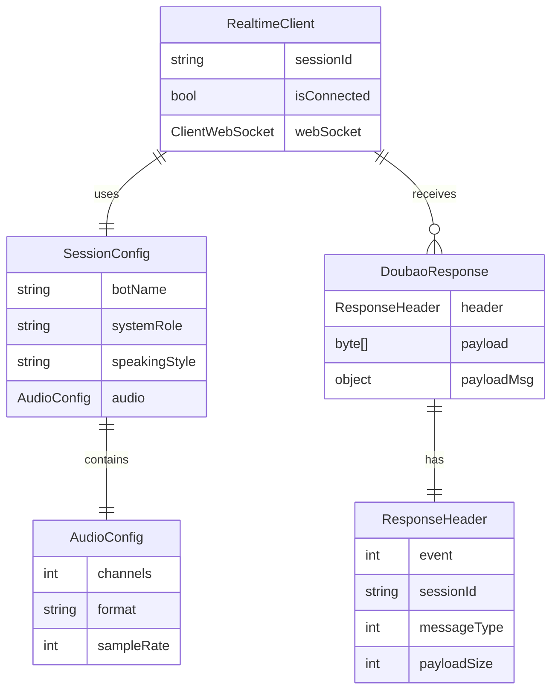

# 豆包实时语音.NET技术架构文档

## 1. 架构设计



## 2. 技术描述

- 前端：.NET 6+ + System.Net.WebSockets
- 后端：豆包实时语音API (WebSocket)
- 协议：自定义二进制协议 + JSON + GZIP压缩
- 音频格式：PCM 16kHz/24kHz

## 3. 路由定义

由于这是一个客户端SDK，不涉及传统的HTTP路由，而是WebSocket事件路由：

| 事件ID | 事件名称 | 方向 | 用途 |
|--------|----------|------|------|
| 1 | StartConnection | Client → Server | 建立WebSocket连接 |
| 100 | StartSession | Client → Server | 开始对话会话 |
| 200 | TaskRequest | Client → Server | 发送音频数据 |
| 300 | SayHello | Client → Server | 发送问候消息 |
| 500 | ChatTTSText | Client → Server | 发送文本合成请求 |
| 450 | ASRInfo | Server → Client | ASR开始信号 |
| 451 | ASRResponse | Server → Client | ASR识别结果 |
| 459 | ASREnded | Server → Client | ASR结束信号 |
| 352 | TTSResponse | Server → Client | TTS音频数据 |
| 152 | SessionFinished | Server → Client | 会话结束通知 |

## 4. API定义

### 4.1 核心API

#### 连接管理
```csharp
// 连接到豆包API
Task<bool> ConnectAsync(string appId, string accessKey, string? connectId = null)
```

请求参数:
| 参数名 | 参数类型 | 是否必需 | 描述 |
|--------|----------|----------|------|
| appId | string | true | 豆包应用ID |
| accessKey | string | true | 豆包访问密钥 |
| connectId | string | false | 连接标识符 |

响应:
| 参数名 | 参数类型 | 描述 |
|--------|----------|------|
| result | boolean | 连接是否成功 |

#### 会话管理
```csharp
// 开始会话
Task<bool> StartSessionAsync(SessionConfig config)
```

请求参数:
| 参数名 | 参数类型 | 是否必需 | 描述 |
|--------|----------|----------|------|
| config | SessionConfig | true | 会话配置 |

```csharp
public class SessionConfig
{
    public string BotName { get; set; } = "豆包";
    public string SystemRole { get; set; } = "你使用活泼灵动的女声，性格开朗，热爱生活。";
    public string SpeakingStyle { get; set; } = "你的说话风格简洁明了，语速适中，语调自然。";
    public AudioConfig Audio { get; set; } = new();
}

public class AudioConfig
{
    public int Channels { get; set; } = 1;
    public string Format { get; set; } = "pcm";
    public int SampleRate { get; set; } = 24000;
}
```

#### 音频处理
```csharp
// 发送音频数据
Task<bool> SendAudioAsync(byte[] audioData)
```

请求参数:
| 参数名 | 参数类型 | 是否必需 | 描述 |
|--------|----------|----------|------|
| audioData | byte[] | true | PCM音频数据 |

#### 文本处理
```csharp
// 发送文本合成请求
Task<bool> SendTextAsync(string text)
```

请求参数:
| 参数名 | 参数类型 | 是否必需 | 描述 |
|--------|----------|----------|------|
| text | string | true | 要合成的文本内容 |

### 4.2 事件回调API

```csharp
// 文本识别结果
event Action<string> OnTextReceived;

// 音频数据接收
event Action<byte[]> OnAudioReceived;

// 错误处理
event Action<string> OnError;

// 连接状态变化
event Action<bool> OnConnectionChanged;
```

## 5. 服务器架构图



## 6. 数据模型

### 6.1 数据模型定义



### 6.2 数据定义语言

#### 核心数据结构

```csharp
// 会话配置
public class SessionConfig
{
    /// <summary>
    /// 机器人名称，默认为"豆包"
    /// </summary>
    public string BotName { get; set; } = "豆包";
    
    /// <summary>
    /// 系统角色设定
    /// </summary>
    public string SystemRole { get; set; } = "你使用活泼灵动的女声，性格开朗，热爱生活。";
    
    /// <summary>
    /// 说话风格
    /// </summary>
    public string SpeakingStyle { get; set; } = "你的说话风格简洁明了，语速适中，语调自然。";
    
    /// <summary>
    /// 音频配置
    /// </summary>
    public AudioConfig Audio { get; set; } = new();
}

// 音频配置
public class AudioConfig
{
    /// <summary>
    /// 声道数，默认为1（单声道）
    /// </summary>
    public int Channels { get; set; } = 1;
    
    /// <summary>
    /// 音频格式，默认为"pcm"
    /// </summary>
    public string Format { get; set; } = "pcm";
    
    /// <summary>
    /// 采样率，默认为24000Hz
    /// </summary>
    public int SampleRate { get; set; } = 24000;
}

// 豆包响应
public class DoubaoResponse
{
    /// <summary>
    /// 响应头信息
    /// </summary>
    public ResponseHeader? Header { get; set; }
    
    /// <summary>
    /// 原始负载数据
    /// </summary>
    public byte[]? Payload { get; set; }
    
    /// <summary>
    /// 解析后的负载消息
    /// </summary>
    public object? PayloadMsg { get; set; }
    
    /// <summary>
    /// 事件ID（快捷访问）
    /// </summary>
    public int Event => Header?.Event ?? 0;
    
    /// <summary>
    /// 会话ID（快捷访问）
    /// </summary>
    public string SessionId => Header?.SessionId ?? string.Empty;
}

// 响应头
public class ResponseHeader
{
    /// <summary>
    /// 协议版本
    /// </summary>
    public byte ProtocolVersion { get; set; }
    
    /// <summary>
    /// 消息类型
    /// </summary>
    public int MessageType { get; set; }
    
    /// <summary>
    /// 事件ID
    /// </summary>
    public int Event { get; set; }
    
    /// <summary>
    /// 会话ID
    /// </summary>
    public string SessionId { get; set; } = string.Empty;
    
    /// <summary>
    /// 负载大小
    /// </summary>
    public int PayloadSize { get; set; }
    
    /// <summary>
    /// 序列化方法
    /// </summary>
    public byte SerializationMethod { get; set; }
    
    /// <summary>
    /// 压缩方法
    /// </summary>
    public byte CompressionMethod { get; set; }
}
```

#### 协议常量定义

```csharp
// 协议常量
public static class ProtocolConstants
{
    // 协议版本
    public const byte PROTOCOL_VERSION = 0x01;
    public const byte DEFAULT_HEADER_SIZE = 0x01;
    
    // 消息类型
    public const byte CLIENT_FULL_REQUEST = 0x01;
    public const byte CLIENT_AUDIO_ONLY_REQUEST = 0x02;
    public const byte SERVER_FULL_RESPONSE = 0x09;
    public const byte SERVER_ACK = 0x0B;
    public const byte SERVER_ERROR_RESPONSE = 0x0F;
    
    // 消息标志
    public const byte NO_SEQUENCE = 0x00;
    public const byte MSG_WITH_EVENT = 0x04;
    
    // 序列化方法
    public const byte NO_SERIALIZATION = 0x00;
    public const byte JSON = 0x01;
    
    // 压缩方法
    public const byte NO_COMPRESSION = 0x00;
    public const byte GZIP = 0x01;
    
    // 事件类型
    public const int START_CONNECTION = 1;
    public const int FINISH_CONNECTION = 2;
    public const int START_SESSION = 100;
    public const int FINISH_SESSION = 102;
    public const int TASK_REQUEST = 200;
    public const int SAY_HELLO = 300;
    public const int CHAT_TTS_TEXT = 500;
    
    // 服务器事件
    public const int ASR_INFO = 450;
    public const int ASR_RESPONSE = 451;
    public const int ASR_ENDED = 459;
    public const int TTS_RESPONSE = 352;
    public const int SESSION_FINISHED = 152;
}
```

#### 错误处理模型

```csharp
// 实时语音异常
public class RealtimeException : Exception
{
    /// <summary>
    /// 错误代码
    /// </summary>
    public string ErrorCode { get; }
    
    /// <summary>
    /// 会话ID
    /// </summary>
    public string SessionId { get; }
    
    /// <summary>
    /// 事件ID（如果适用）
    /// </summary>
    public int? EventId { get; }
    
    public RealtimeException(string errorCode, string message, string sessionId = "", int? eventId = null) 
        : base(message)
    {
        ErrorCode = errorCode;
        SessionId = sessionId;
        EventId = eventId;
    }
}

// 连接异常
public class ConnectionException : RealtimeException
{
    public ConnectionException(string message) 
        : base("CONNECTION_ERROR", message)
    {
    }
}

// 协议异常
public class ProtocolException : RealtimeException
{
    public ProtocolException(string message, int? eventId = null) 
        : base("PROTOCOL_ERROR", message, eventId: eventId)
    {
    }
}
```

#### 配置验证

```csharp
// 配置验证器
public static class ConfigValidator
{
    public static void ValidateSessionConfig(SessionConfig config)
    {
        if (config == null)
            throw new ArgumentNullException(nameof(config));
            
        if (string.IsNullOrWhiteSpace(config.BotName))
            throw new ArgumentException("BotName不能为空", nameof(config.BotName));
            
        if (config.BotName.Length > 20)
            throw new ArgumentException("BotName长度不能超过20个字符", nameof(config.BotName));
            
        var totalRoleLength = (config.SystemRole?.Length ?? 0) + (config.SpeakingStyle?.Length ?? 0);
        if (totalRoleLength > 1500)
            throw new ArgumentException("SystemRole和SpeakingStyle合计长度不能超过1500个字符");
            
        ValidateAudioConfig(config.Audio);
    }
    
    public static void ValidateAudioConfig(AudioConfig config)
    {
        if (config == null)
            throw new ArgumentNullException(nameof(config));
            
        if (config.Channels != 1)
            throw new ArgumentException("目前只支持单声道音频", nameof(config.Channels));
            
        if (config.SampleRate <= 0)
            throw new ArgumentException("采样率必须大于0", nameof(config.SampleRate));
            
        if (!new[] { "pcm", "pcm_s16le" }.Contains(config.Format))
            throw new ArgumentException("不支持的音频格式", nameof(config.Format));
    }
}
```

## 7. 性能优化策略

### 7.1 内存管理
- 使用 `ArrayPool<byte>` 减少大对象分配
- 及时释放WebSocket资源
- 避免不必要的字符串拼接

### 7.2 网络优化
- 使用二进制协议减少传输开销
- GZIP压缩减少带宽使用
- 连接复用避免频繁建立连接

### 7.3 并发处理
- 异步I/O操作避免线程阻塞
- 使用 `ConfigureAwait(false)` 避免死锁
- 合理的超时设置

## 8. 安全考虑

### 8.1 认证安全
- AppID和AccessKey通过HTTPS头传输
- 不在日志中记录敏感信息
- 支持连接ID追踪

### 8.2 数据安全
- 音频数据加密传输（WSS）
- 输入验证防止注入攻击
- 错误信息不泄露敏感数据

### 8.3 连接安全
- 连接超时保护
- 异常断线重连机制
- 资源泄漏防护

这个技术架构文档提供了简化后的豆包实时语音.NET客户端的完整技术规范，确保实现的一致性和可维护性。